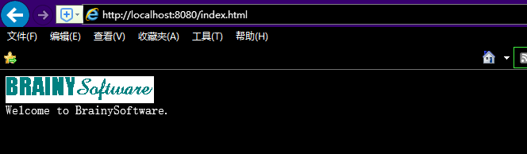
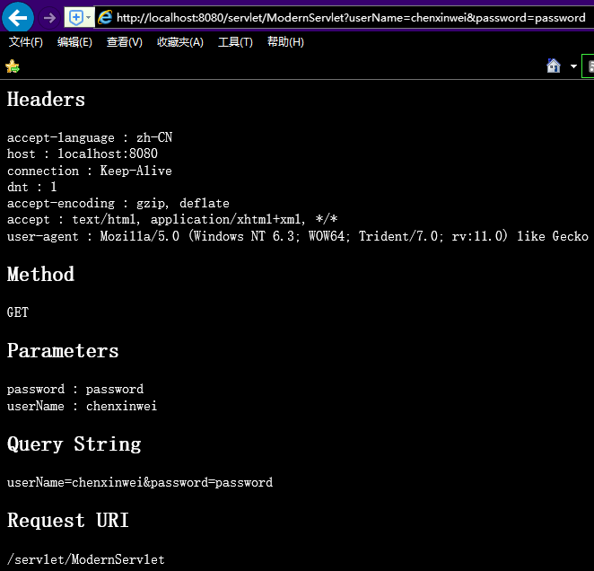

# 第 3 章:应用程序

## `idea`工程新建`resources`目录放置资源文件
`src\main\resources\ex03\pyrmont\connector\http`

## 使用`Internet Explorer 11`访问

1.`http://localhost:8080/index.html`

2.`http://localhost:8080/servlet/ModernServlet?userName=chenxinwei&password=password`



`HttpConnector`从
`java.net.ServerSocket`类的`accept`方法中获得一个套接字之后，一个`HttpProcessor`实例会
被创建，并且通过传递该套 接字给它的`process`方法调用。

## 解析Http

- 读取套接字的输入流
- 解析请求行
- 解析头部
- 解析`cookies`
- 获取参数

> 解析请求行

> `HttpRequestLine.java`

```java
    public char[] method;
    public int methodEnd;
    public char[] uri;
    public int uriEnd;
    public char[] protocol;
    public int protocolEnd;
```
`GET /myApp/ModernServlet?userName=tarzan&password=pwd HTTP/1.1`
在 servlet/JSP 编程中，参数名 jsessionid 是用来携带一
个会话标识符。会话标识符经常被作为 cookie 来嵌入，但符串去，例如，当浏览器的 cookie 被禁用的时候.

> 解析头部

> `HttpHeader.java`

```java
    public char[] name;
    public int nameEnd;
    public char[] value;
    public int valueEnd;
    protected int hashCode = 0;
```

一个 HTTP 头部是用类 HttpHeader 来代表的。这个类将会在第 4 章详细解释，而现在知道下
面的内容就足够了：

- 你可以通过使用类的无参数构造方法构造一个`HttpHeader`实例。
- 一旦你拥有一个`HttpHeader`实例，你可以把它传递给`SocketInputStream`的`readHeader`
方法。假如这里有头部需要读取，`readHeader`方法将会相应的填充`HttpHeader`对象。
假如再也没有头部需要读取了，HttpHeader 实例的`nameEnd`和`valueEnd`字段将会置零。
- 为了获取头部的名称和值，使用下面的方法：
- `String name = new String(header.name, 0, header.nameEnd);`
- `String value = new String(header.value, 0, header.valueEnd);`