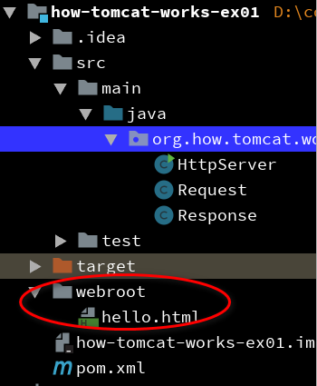

# 第一章:一个简单的 Web 服务器

## WEB服务器是如何工作的

1.在工程下新建一个webroot文件夹，放入一个html文件


2.启动internet explorer 浏览器，查看前台和后台


## 源码分析

> `HttpServer.java`

```java
package org.how.tomcat.works.ex01;

import java.io.File;
import java.io.IOException;
import java.io.InputStream;
import java.io.OutputStream;
import java.net.InetAddress;
import java.net.ServerSocket;
import java.net.Socket;
public class HttpServer {
   // 运行时才知道System.getProperty("user.dir")，故不会替换
   public static final String WEB_ROOT = System.getProperty("user.dir")
           + File.separator + "webroot";
   // shutdown command
   // 编译时能确定字符串，故用到SHUTDOWN_COMMAND的地方会直接替换
   private static final String SHUTDOWN_COMMAND = "/SHUTDOWN";
   // the shutdown command received
   private boolean shutdown = false;
   public static void main(String[] args) {
       HttpServer server = new HttpServer();
       server.await();
   }

   public void await() {
       ServerSocket serverSocket = null;
       int port = 8080;
       try {
           //建立一个socket连接
           serverSocket = new ServerSocket(port, 1, InetAddress
                   .getByName("127.0.0.1"));
       } catch (IOException e) {
           e.printStackTrace();
           System.exit(1);
       }
       // Loop waiting for a request
       while (!shutdown) {
           Socket socket = null;
           InputStream input = null;
           OutputStream output = null;

           try {
               socket = serverSocket.accept();
               //得到客户端(client)的输入流
               input = socket.getInputStream();
               //得到指向客户端的输出流
               output = socket.getOutputStream();
               // create Request object and parse
               Request request = new Request(input);
               request.parse();

               // create Response object
               Response response = new Response(output);
               response.setRequest(request);
               response.sendStaticResource();

               // Close the socket
               socket.close();
               // check if the previous URI is a shutdown command
               shutdown = request.getUri().equals(SHUTDOWN_COMMAND);
           } catch (Exception e) {
               e.printStackTrace();
               continue;
           }
       }
   }
}
```
> `Request.java`

一个Request示例

```
GET /hello.html HTTP/1.1
Accept: text/html, application/xhtml+xml, */*
Accept-Language: zh-CN
User-Agent: Mozilla/5.0 (Windows NT 6.3; WOW64; Trident/7.0; rv:11.0) like Gecko
Accept-Encoding: gzip, deflate
Host: localhost:8080
DNT: 1
Connection: Keep-Alive
```

```java
package org.how.tomcat.works.ex01;

import java.io.IOException;
import java.io.InputStream;
/**
* 从输入流读取请求，并处理uri
*/
public class Request {
    private InputStream input;
    private String uri;

    public Request(InputStream input) {
        this.input = input;
    }

    public void parse() {
        // Read a set of characters from the socket
        StringBuffer request = new StringBuffer(2048);
        int i;
        byte[] buffer = new byte[2048];
        try {
            i = input.read(buffer);
        } catch (IOException e) {
            e.printStackTrace();
            i = -1;
        }
        
        //
        request.append(new String(buffer, 0, i));
        System.out.print(request.toString());
        uri = parseUri(request.toString());
    }
    //GET /hello.html HTTP/1.1
    private String parseUri(String requestString) {
        int index1, index2;
        index1 = requestString.indexOf(' ');
        if (index1 != -1) {
            index2 = requestString.indexOf(' ', index1 + 1);
            if (index2 > index1) {
                return requestString.substring(index1 + 1, index2);
            }
        }
        return null;
    }

    public String getUri() {
        return uri;
    }
}
```

> `Response.java`

```java
package org.how.tomcat.works.ex01;

import java.io.File;
import java.io.FileInputStream;
import java.io.IOException;
import java.io.OutputStream;

public class Response {
    private static final int BUFFER_SIZE = 1024;
    Request request;
    OutputStream output;

    public Response(OutputStream output) {
        this.output = output;
    }

    public void setRequest(Request request) {
        this.request = request;
    }
    /**
    * 得到服务器上的文件，如果文件存在，读取文件流，写向客户机
    * @throws IOException
    */
    public void sendStaticResource() throws IOException {
        byte[] bytes = new byte[BUFFER_SIZE];
        FileInputStream fis = null;
        try {
            File file = new File(HttpServer.WEB_ROOT, request.getUri());
            if (file.exists()) {
                fis = new FileInputStream(file);
                int ch;
                while ((ch = fis.read(bytes, 0, BUFFER_SIZE)) != -1) {
                    output.write(bytes, 0, ch);
                }
            } else {
                // file not found
                String errorMessage = "HTTP/1.1 404 File Not Found\r\n"
                        + "Content-Type: text/html\r\n"
                        + "Content-Length: 23\r\n" + "\r\n"
                        + "<h1>File Not Found</h1>";
                output.write(errorMessage.getBytes());
            }
        } catch (Exception e) {
            // thrown if cannot instantiate a File object
            System.out.println(e.toString());
        } finally {
            if (fis != null) {
                fis.close();
            }
        }
    }
}
```