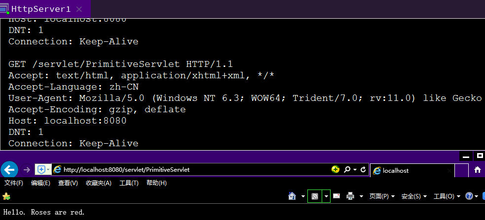
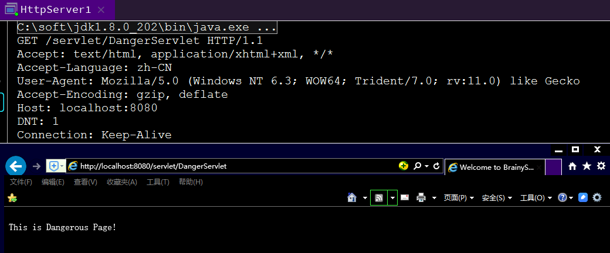

# 第 2 章:一个简单的 Servlet 容器

## 加载`Servlet` 示例加载`PrimitiveServlet`

```java
import java.io.IOException;
import java.io.PrintWriter;
import javax.servlet.Servlet;
import javax.servlet.ServletConfig;
import javax.servlet.ServletException;
import javax.servlet.ServletRequest;
import javax.servlet.ServletResponse;

public class PrimitiveServlet implements Servlet {
    public PrimitiveServlet() {
    }

    public void init(ServletConfig var1) throws ServletException {
        System.out.println("init");
    }

    public void service(ServletRequest var1, ServletResponse var2) throws ServletException, IOException {
        System.out.println("from service");
        PrintWriter var3 = var2.getWriter();
        var3.println("Hello. Roses are red.");
        var3.print("Violets are blue.");
    }

    public void destroy() {
        System.out.println("destroy");
    }

    public String getServletInfo() {
        return null;
    }

    public ServletConfig getServletConfig() {
        return null;
    }
}
```
> `Constants.java`

抽出常量，便于统一管理

```java
package org.how.tomcat.works.ex02;

import java.io.File;

public class Constants {
    public static final String WEB_ROOT =
            System.getProperty("user.dir") + File.separator + "webroot";
}
```

> `HttpServer1.java`

相比于`HttpServer`多一个`if`判断

```java
if (request.getUri().startsWith("/servlet/")) {
    ServletProcessor1 processor = new ServletProcessor1();
    processor.process(request, response);
} else {
    StaticResourceProcessor processor = new StaticResourceProcessor();
    processor.process(request, response);
}
```

```java
package org.how.tomcat.works.ex02;

import java.io.IOException;
import java.io.InputStream;
import java.io.OutputStream;
import java.net.InetAddress;
import java.net.ServerSocket;
import java.net.Socket;

public class HttpServer1 {
    // shutdown command
    private static final String SHUTDOWN_COMMAND = "/SHUTDOWN";

    // the shutdown command received
    private boolean shutdown = false;

    public static void main(String[] args) {
        HttpServer1 server = new HttpServer1();
        server.await();
    }

    public void await() {
        ServerSocket serverSocket = null;
        int port = 8080;
        try {
            serverSocket = new ServerSocket(port, 1, InetAddress.getByName("127.0.0.1"));
        } catch (IOException e) {
            e.printStackTrace();
            System.exit(1);
        }

        // Loop waiting for a request
        while (!shutdown) {
            Socket socket = null;
            InputStream input = null;
            OutputStream output = null;
            try {
                socket = serverSocket.accept();
                input = socket.getInputStream();
                output = socket.getOutputStream();

                // create Request object and parse
                Request request = new Request(input);
                request.parse();

                // create Response object
                Response response = new Response(output);
                response.setRequest(request);

                // check if this is a request for a servlet or a static resource
                // a request for a servlet begins with "/servlet/"
                if (request.getUri().startsWith("/servlet/")) {
                    ServletProcessor1 processor = new ServletProcessor1();
                    processor.process(request, response);
                } else {
                    StaticResourceProcessor processor = new StaticResourceProcessor();
                    processor.process(request, response);
                }

                // Close the socket
                socket.close();
                //check if the previous URI is a shutdown command
                shutdown = request.getUri().equals(SHUTDOWN_COMMAND);
            } catch (Exception e) {
                e.printStackTrace();
                System.exit(1);
            }
        }
    }
}
```

> `Response`实现`javax.servlet.ServletResponse`接口
`Request`实现`javax.servlet.ServletRequest`接口

注意：接口只定义方法，不具体实现方法

> `ServletProcessor1.java`

使用类加载器加载`Servlet`,加载到`webroot`下的`Servlet`之后执行其`service方法`
```java
package org.how.tomcat.works.ex02;

import javax.servlet.Servlet;
import javax.servlet.ServletRequest;
import javax.servlet.ServletResponse;
import java.io.File;
import java.io.IOException;
import java.net.URL;
import java.net.URLClassLoader;
import java.net.URLStreamHandler;

public class ServletProcessor1 {
    public void process(Request request, Response response) {
        String uri = request.getUri();
        //获取请求的Servlet名字
        String servletName = uri.substring(uri.lastIndexOf("/") + 1);
        URLClassLoader loader = null;

        try {
            // create a URLClassLoader
            URL[] urls = new URL[1];
            URLStreamHandler streamHandler = null;
            File classPath = new File(Constants.WEB_ROOT);

            // the forming of repository is taken from the createClassLoader
            // method in
            // org.apache.catalina.startup.ClassLoaderFactory
            String repository = (new URL("file", null,
                    classPath.getCanonicalPath() + File.separator)).toString();

            // the code for forming the URL is taken from the addRepository
            // method in
            // org.apache.catalina.loader.StandardClassLoader class.
            urls[0] = new URL(null, repository, streamHandler);

            loader = new URLClassLoader(urls);
        } catch (IOException e) {
            System.out.println(e.toString());
        }

        Class<?> myClass = null;

        try {
            myClass = loader.loadClass(servletName);
        } catch (ClassNotFoundException e) {
            System.out.println(e.toString());
        }

        Servlet servlet = null;

        try {
            servlet = (Servlet) myClass.newInstance();
            servlet.service((ServletRequest) request,
                    (ServletResponse) response);
        } catch (Exception e) {
            System.out.println(e.toString());
        } catch (Throwable e) {
            System.out.println(e.toString());
        }

    }
}
```



## 以上有个问题，知道了`Servlet`容器的内部运行的`Servlet`程序员可以分别把`ServletRequest`和`ServletResponse`
实例向下转换为`Request`和`Response`并调用他们的公共方法

如下：
> `DangerServlet.java`

在些`Servlet`中，分别对`Request`和`Response`进行强制转换。进行一些操作
```java
import org.how.tomcat.works.ex02.Request;
import org.how.tomcat.works.ex02.Response;

import javax.servlet.*;
import java.io.IOException;
import java.lang.reflect.Field;

public class DangerServlet implements Servlet {
    @Override
    public void init(ServletConfig servletConfig) throws ServletException {
        System.out.println("init");
    }

    @Override
    public ServletConfig getServletConfig() {
        return null;
    }

    @Override
    public void service(ServletRequest servletRequest, ServletResponse servletResponse) throws ServletException, IOException {
        Request request = (Request) (servletRequest);
        Class<?> clazz = request.getClass();
        try {
            Field field = clazz.getDeclaredField("uri");
            field.setAccessible(true);
            field.set(request, "danger.html");
        } catch (NoSuchFieldException e) {
            e.printStackTrace();
        } catch (IllegalAccessException e) {
            e.printStackTrace();
        }

        Response response = (Response)servletResponse;
        response.sendStaticResource();
    }

    @Override
    public String getServletInfo() {
        return null;
    }

    @Override
    public void destroy() {
        System.out.println("destroy");
    }
}
```

> `danger.html`

```html
<html>
<head>
    <title>Dangerous</title>
</head>
<body>
<br>
This is Dangerous Page!
</body>
</html>
```




## 怎样避免上述风险
1.上述风险主要由`ServletProcessor1`直接调用`servlet`的`service`遭成的。
2.`RequestFacade`和`ResponseFacade`分别对`Request`和`Response`进行封装。不提供调用
将`request.parse()`方法和`response.sendStaticResource()`的窗口。

> `ServletProcessor2.java`变化一下
```java
    Servlet servlet = null;
    RequestFacade requestFacade = new RequestFacade(request);
    ResponseFacade responseFacade = new ResponseFacade(response);
    try {
        servlet = (Servlet) myClass.newInstance();
        servlet.service((ServletRequest) requestFacade, (ServletResponse) responseFacade);
    } catch (Exception e) {
        System.out.println(e.toString());
    } catch (Throwable e) {
        System.out.println(e.toString());
    }
```
> `RequestFacade.java`

```java
package org.how.tomcat.works.ex02;

import javax.servlet.RequestDispatcher;
import javax.servlet.ServletInputStream;
import javax.servlet.ServletRequest;
import java.io.BufferedReader;
import java.io.IOException;
import java.io.UnsupportedEncodingException;
import java.util.Enumeration;
import java.util.Locale;
import java.util.Map;

public class RequestFacade implements ServletRequest {

    private ServletRequest request = null;

    public RequestFacade(Request request) {
        this.request = request;
    }

    /* implementation of the ServletRequest*/
    @Override
    public Object getAttribute(String attribute) {
        return request.getAttribute(attribute);
    }

    @Override
    public Enumeration getAttributeNames() {
        return request.getAttributeNames();
    }

    @Override
    public String getRealPath(String path) {
        return request.getRealPath(path);
    }

    @Override
    public RequestDispatcher getRequestDispatcher(String path) {
        return request.getRequestDispatcher(path);
    }

    @Override
    public boolean isSecure() {
        return request.isSecure();
    }

    @Override
    public String getCharacterEncoding() {
        return request.getCharacterEncoding();
    }

    @Override
    public int getContentLength() {
        return request.getContentLength();
    }

    @Override
    public String getContentType() {
        return request.getContentType();
    }

    @Override
    public ServletInputStream getInputStream() throws IOException {
        return request.getInputStream();
    }

    @Override
    public Locale getLocale() {
        return request.getLocale();
    }

    @Override
    public Enumeration getLocales() {
        return request.getLocales();
    }

    @Override
    public String getParameter(String name) {
        return request.getParameter(name);
    }

    @Override
    public Map getParameterMap() {
        return request.getParameterMap();
    }

    @Override
    public Enumeration getParameterNames() {
        return request.getParameterNames();
    }

    @Override
    public String[] getParameterValues(String parameter) {
        return request.getParameterValues(parameter);
    }

    @Override
    public String getProtocol() {
        return request.getProtocol();
    }

    @Override
    public BufferedReader getReader() throws IOException {
        return request.getReader();
    }

    @Override
    public String getRemoteAddr() {
        return request.getRemoteAddr();
    }

    @Override
    public String getRemoteHost() {
        return request.getRemoteHost();
    }

    @Override
    public String getScheme() {
        return request.getScheme();
    }

    @Override
    public String getServerName() {
        return request.getServerName();
    }

    @Override
    public int getServerPort() {
        return request.getServerPort();
    }

    @Override
    public void removeAttribute(String attribute) {
        request.removeAttribute(attribute);
    }

    @Override
    public void setAttribute(String key, Object value) {
        request.setAttribute(key, value);
    }

    @Override
    public void setCharacterEncoding(String encoding)
            throws UnsupportedEncodingException {
        request.setCharacterEncoding(encoding);
    }

}
```
> `ResponseFacade.java`

```java
package org.how.tomcat.works.ex02;

import javax.servlet.ServletOutputStream;
import javax.servlet.ServletResponse;
import java.io.IOException;
import java.io.PrintWriter;
import java.util.Locale;

public class ResponseFacade implements ServletResponse {

    private ServletResponse response;

    public ResponseFacade(Response response) {
        this.response = response;
    }

    @Override
    public void flushBuffer() throws IOException {
        response.flushBuffer();
    }

    @Override
    public int getBufferSize() {
        return response.getBufferSize();
    }

    @Override
    public String getCharacterEncoding() {
        return response.getCharacterEncoding();
    }

    @Override
    public Locale getLocale() {
        return response.getLocale();
    }

    @Override
    public ServletOutputStream getOutputStream() throws IOException {
        return response.getOutputStream();
    }

    @Override
    public PrintWriter getWriter() throws IOException {
        return response.getWriter();
    }

    @Override
    public boolean isCommitted() {
        return response.isCommitted();
    }

    @Override
    public void reset() {
        response.reset();
    }

    @Override
    public void resetBuffer() {
        response.resetBuffer();
    }

    @Override
    public void setBufferSize(int size) {
        response.setBufferSize(size);
    }

    @Override
    public void setContentLength(int length) {
        response.setContentLength(length);
    }

    @Override
    public void setContentType(String type) {
        response.setContentType(type);
    }

    @Override
    public void setLocale(Locale locale) {
        response.setLocale(locale);
    }

}
```